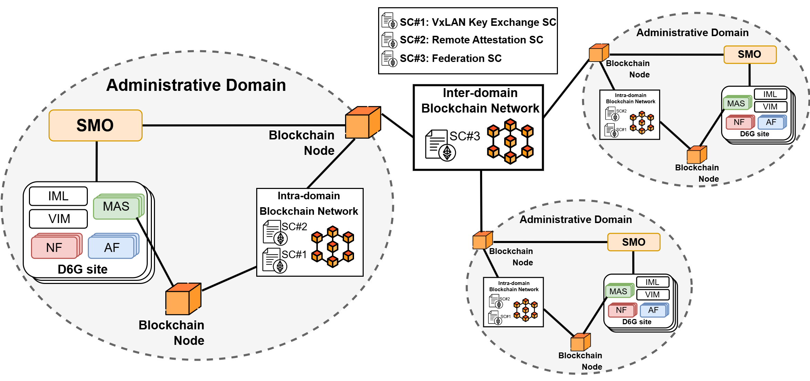

# DLT Network Transactions Dataset

This project provides a dataset of all transactions occurring within the DLT network of the [DESIRE6G](https://desire6g.eu/) platform, encompassing both [Service Federation](./data/service-federation) and [Multi-Agent System (MAS) Security](./data/mas-security). The dataset helps for identifying any anomalies, understanding network behaviour, and ensuring the integrity of the data.

The dataset was generated by monitoring a private Ethereum-based blockchain network using the [Geth](https://geth.ethereum.org/) framework with a [PoA (Proof-of-Authority)](https://github.com/ethereum/EIPs/issues/225) consensus algorithm. Data collection was automated with a [Docker container](./data-collector-container) that captures detailed transaction information in real-time, including interactions with smart contracts, and exports the results to a CSV file.

## Authors

- Adam Zahir from Universidad Carlos III de Madrid (UC3M)
- Pol González from Universitat Politecnica de Catalunya (UPC)
- Mark Angoustures from sarl TAGES SOLIDSHIELD (TSS)

## Structure of the Dataset

The dataset includes the following attributes:

- **blockNumber**: The number of the block containing the transaction.
- **timestamp**: The timestamp of the block containing the transaction.
- **transactionHash**: The hash of the transaction.
- **from**: The address of the sender.
- **to**: The address of the recipient.
- **value**: The value transferred in the transaction (in Ether).
- **gas**: The gas provided for the transaction.
- **gasPrice**: The price of gas for the transaction (in Gwei).
- **nonce**: The number of transactions made by the sender prior to this one.
- **status**: The status of the transaction (1 for success, 0 for failure).
- **contractAddress**: The address of the contract, if the transaction created a contract; otherwise `None`.
- **contractName**: The name of the smart contract, if the transaction interacts with a known contract; otherwise `None`.
- **functionName**: The name of the function called in the smart contract, if applicable; otherwise `None`.

## Further Information

- The dataset is also available on Zenodo: [Zenodo Dataset Link] 
- Further information on DLT-based Service Federation and MAS in DESIRE6G can be found in Deliverable [D3.1: Initial report on the intelligent and secure management, orchestration, and control platform](https://zenodo.org/records/10356033)

## Acknowledgments
This work has been partly funded by the European Commission Horizon Europe SNS JU [DESIRE6G](https://desire6g.eu/) project, under grant agreement No.101096466.